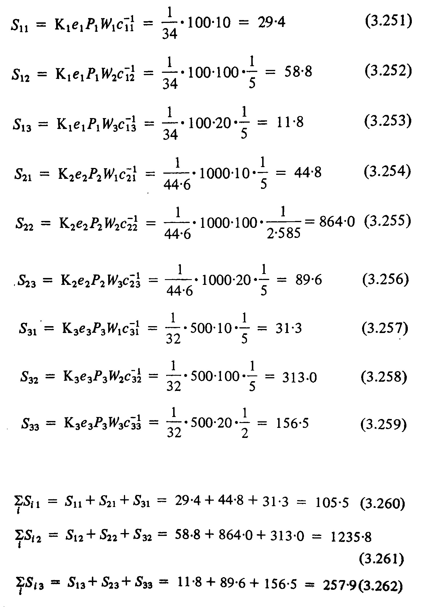
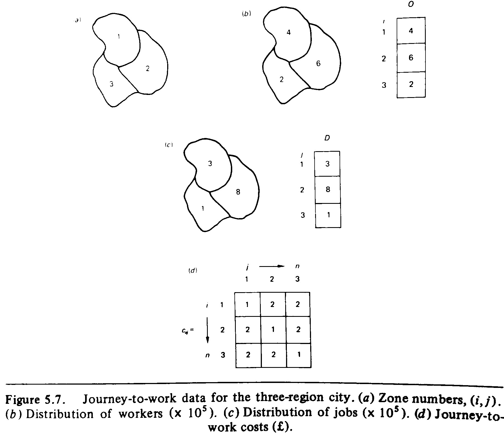
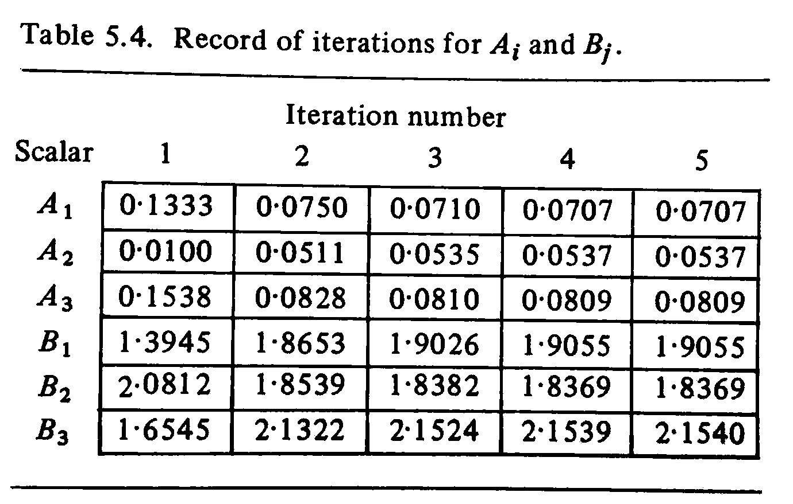
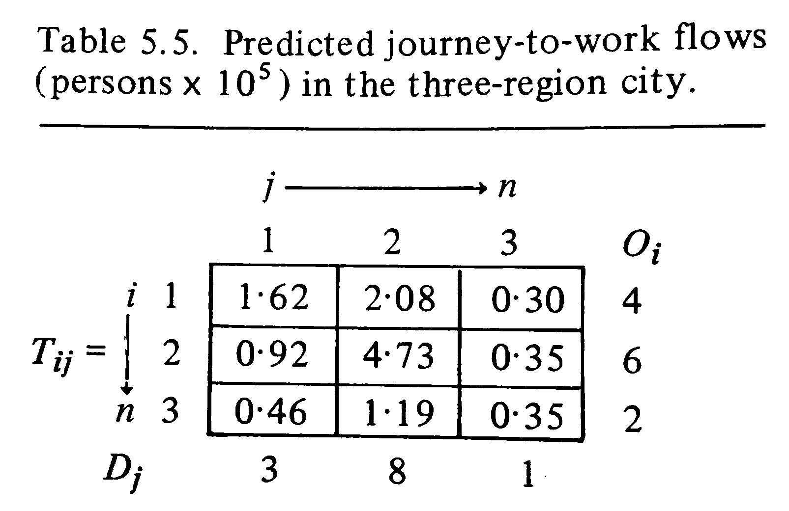

# Introduction

For the moment this vignette shows only minimal examples on how to use the moin package. These are from textbooks presenting methods on singly- and doubly-constrained interaction models. The examples correspond to those from the help document to the functions. However, here also the expected results are shown.

## Singly-constrained model -- A location model.

$$
flows_{ij} = O_i \frac{W_j^\alpha c_{ij}^{-\beta}}{\sum_j W_j^\alpha c_{ij}^{-\beta}}
$$

where $O_i$ are the sources of flows and $W_j$ is the attractiveness of the target. It can be weighted by $\alpha$. $c_{ij}$ are the travel costs that can be weighted with $\beta$.

Load the package

```{r load}
library(moin)
```

Create some data. These stem from @wilson_mathematics_1980, p. 100f. 

- `Pi` is the population of zone i
- `ei` is the mean expenditure on shopping goods per head in zone i
- `Wj` is the attractiveness of shops in zone j
- `cij` is the cost of travel from i to j

```{r sc-data}
ei <- c(2,1,1)
Pi <- c(50, 1000, 500)
Wj <- c(10, 100, 20)
cij <- matrix(data = c(1, 5, 5,
                      5, 2.585, 5,
                      5, 5, 2),
              nr = 3,
              nc = 3
)
```

Apply the model

```{r modelapp}
sc(Oi = ei * Pi, Wj = Wj, cij = cij, detfun = "power")
```

Here are the original data. $S_{11}$ to $S_{33}$ correspond to the `flows` as returned by `sc` function. `Dj` corresponds to $\sum_i S_{ij}$


```{r, echo=FALSE, out.width = "500px", fig.align = "center"}

```

What is important here? The main characteristics is that the flow totals are constrained by $e_i * P_i$. Due to this it can act as a location model and predict the spatial distribution of shopping sales (these are the `Dj` values).

## Doubly-constrained model

$$
T_{ij} = A_i O_i B_j D_j c_{ij}^{-\beta}
$$

with constraints

$$
\sum_j^n T_{ij} = O_i
$$

and 

$$
\sum_i^n T_{ij} = D_j
$$

Therefore, two balancing scalars are necessary to ensure that the origin ($A_i$) and destination ($B_j$) constraints are satisfied. 

$$
A_i = (\sum_j^n B_j D_j c_{ji}^{-\beta})^{-1}
$$

and 

$$
B_j = (\sum_i^n A_i O_i c_{ji}^{-\beta})^{-1}
$$


Create some data. These stem from @thomas_modelling_1980, p. 150. It is a journey-to-work example (see figure)

```{r, echo=FALSE, out.width = "700px", fig.align = "center"}

```

`Oi` refers to workers in zone `i` and `Dj` to jobs in `j`.

```{r dc-data}
Oi <- c(4,6,2)
Dj <- c(3,8,1)
cij <- matrix(data = c(1,2,2,
                       2,1,2,
                       2,2,1
                       ),
               nr = 3,
               nc = 3
               )
beta <- 1
```

Apply the model

```{r dc-apply}
tmp <- dc(Oi = Oi, Dj = Dj, cij = cij, iterations = 5)
str(tmp)
```

Now, the model output is a little longer. `Oi` and `Dj` have Target and `si` or `sj` columns. The former are the input data, the latter the calculated values. 

```{r aibj}
tmp$Ai
tmp$Bj
```

`Ai` and `Bj` refer to the balancing factors. Since these result from simultaneous equations they need to be find by iteration. `iteration` states that the model ran for four iterations, although we stated five explicitly in the model call. The reason is, that the model was balanced already after the fourth iteration. Compared to the values of @thomas_modelling_1980, p. 151 it gets obvious the the values are rather different (this might be caused by rounding effects throughout the calculations). 

```{r, echo=FALSE, out.width = "400px", fig.align = "center"}

```

```{r tij}
round(tmp$Tij, 2)
```

`Tij` shows the flows and these correspond to those from @thomas_modelling_1980, p. 152

```{r, echo=FALSE, out.width = "300px", fig.align = "center"}

```

# A more elaborate example

A location model of settlement locations in SE Turkey

## Load Data

```{r eex_load, out.width = "100%", out.height = "700px", fig.align = "center"}
library(magrittr)
library(rgdal)
library(rgeos)

harran <- readOGR(dsn = "data",
                  layer = "harran_plain") %>%
  spTransform(CRSobj = "+init=epsg:32634")

tellpoly <- readOGR(dsn = "data",
                    layer = "settlements") %>%
  spTransform(CRSobj = "+init=epsg:32634")
tellpoly@data$area <- gArea(tellpoly, byid = TRUE)
tellpoly <- tellpoly[harran,]

tellpoints <- tellpoly %>%
  gCentroid(byid=TRUE) %>%
  SpatialPointsDataFrame(data = data.frame(x = .@coords[,1],
                                           y = .@coords[,2],
                                           Tell = tellpoly@data$Tell))

library(mapview)
## mapview(harran) + mapview(tellpoly) + mapview(tellpoints)
```

## Create Delaunay Graph and calculate the distances between the connected points

```{r eex_del}
library(spdep)
telldel <- tri2nb(coords = tellpoints@coords)

distmat <- gDistance(tellpoints, byid = TRUE)
distmat <- distmat / 1000

for (i in 1:dim(distmat)[1]) {
  distmat[i,-c(telldel[[i]])] <- NA
  }
```	

## Interaction 

```{r eex_moin1, out.width = "100%", out.height = "700px", fig.align = "center"}
library(moin)

int_mod <- sc(Oi = rep(x = 10, times = length(tellpoints)),
              Wj = rep(x = 5, times = length(tellpoints)),
              cij = distmat,
              beta = 1,
              detfun = "power")
tellpoints@data$Dj <- int_mod$Dj

## mapview(tellpoints,
##         cex = tellpoints$Dj,
##         zcol = "Dj")  
```

## Network measures as attributes for Interaction

```{r eex_netw, out.width = "100%", out.height = "700px", fig.align = "center"}
g <- igraph::graph_from_adj_list(adjlist = telldel,
                                 mode = "all")
tellpoints@data$degree <- igraph::degree(g)
tellpoints@data$closeness <- igraph::closeness(g)
tellpoints@data$betweeness <- igraph::betweenness(g)

int_mod <- sc(Oi = rep(x = 10, times = length(tellpoints)),
              Wj = tellpoints@data$degree,
              cij = distmat,
              beta = 1,
              detfun = "power"
              )
tellpoints@data$Dj <- int_mod$Dj

## mapview(tellpoints,
##         cex = tellpoints$Dj,
##         zcol = "Dj")
```

### What is the influence of different beta values on the location importance of sites?

First, let us have a look at changing $\beta$ values for the power function

```{r eex_tests, fig.width = 8, fig.height = 8, fig.align = "center"}
beta_test <- data.frame(beta = 0,
                        Dj = 0,
                        degree = 0
                        )
beta_seq <- seq(from = 0.1, to = 2.0, by = .1)

for (i in 1:length(beta_seq)) {
  j <- beta_seq[i]
  beta_test <- rbind(beta_test, data.frame(beta = rep(j, length(tellpoints)),
                                           Dj = sc(Oi = rep(x = 10, times = length(tellpoints)),
                                                   Wj = tellpoints@data$degree,
                                                   cij = distmat,
                                                   beta = j,
                                                   detfun = "power"
                                                   )$Dj,
                                           degree = tellpoints$degree)
                     )
}
beta_test <- beta_test[2:length(beta_test[,1]),]
head(beta_test)

beta_test2 <- beta_test %>%
  dplyr::as.tbl()

library(ggplot2)
ggplot(beta_test2, aes(x = Dj, y = as.factor(beta), fill = as.factor(degree))) + 
  ggjoy::geom_joy(scale = 2.5, rel_min_height=.01, alpha = .8, color = "white") +
  ggjoy::theme_joy(font_size = 10) +
  theme(legend.position = "bottom") +
  viridis::scale_fill_viridis(discrete=TRUE,
                              name = "Degree centrality") +
  labs(x = "si",
       y = expression(paste(beta," factor of power function")),
       title = "Location attractiveness (Dj) in relation to degree-centrality and distance weight (beta) factors",
       subtitle = "Connections based on Delaunay graph; Origins weighted equally; attractiveness equals degree centrality",
       caption = "Data source: settlements in Harran Ovası, SE Turkey, digitized from Corona satellite images (acquisition dates ~1960-1970)") +   
  guides(fill=guide_legend(nrow = 1))
```

## Further terminology (as such not yet implemented in the package functions)

Source: @rihll_modelling_1988, p. 6:

- **credit**/inflow: the number of interactions destined for a site, i.e. interactions arriving at a site; i.e. the sum of $i$ at some $j$.
- **debit**/outflow: the interaction which originate at a site and which is constrained by the size of a site; i.e. the sum of $j$ for some $i$.

This can be used to create simple site hierarchies:

- $A$ is a lower order settlement than $B$
  - if the greatest single debit/outflow from site $A$ is to site $B$
  - and this single figure is larger than the sum of $A$'s credits/inflow
- A site $B$ is a /*terminal/*
  - if the greatest single debit/outflow from $B$ is to $C$
  - and this single figure is smaller than the total of $B$'s credits/inflows

```{r hierarchy}
test <- sc(Oi = rep(x = 10, times = length(tellpoints)),
           Wj = tellpoints@data$degree*10,
           cij = distmat,
           beta = 2,
           detfun = "exp"
           )
test

tmp <- list()
for (i in 1:dim(test$flows)[1]) {
  if (max(test$flows[i,], na.rm = TRUE) > sum(test$flows[,i], na.rm = TRUE)) {
    tmp[[i]] <- which(test$flows[i,]==max(test$flows[i,], na.rm = TRUE))
  } else {
    tmp[[i]] <- NA
  }
}
unlist(tmp)

terminal <- list()
for (i in 1:dim(test$flows)[1]) {
  if (max(test$flows[i,], na.rm = TRUE) < sum(test$flows[,i], na.rm = TRUE)) {
    terminal[[i]] <- which(test$flows[i,]==max(test$flows[i,], na.rm = TRUE))
  } else {
    tmp[[i]] <- NA
  }  
}
unlist(terminal)

table(unlist(terminal))
```	


# References
